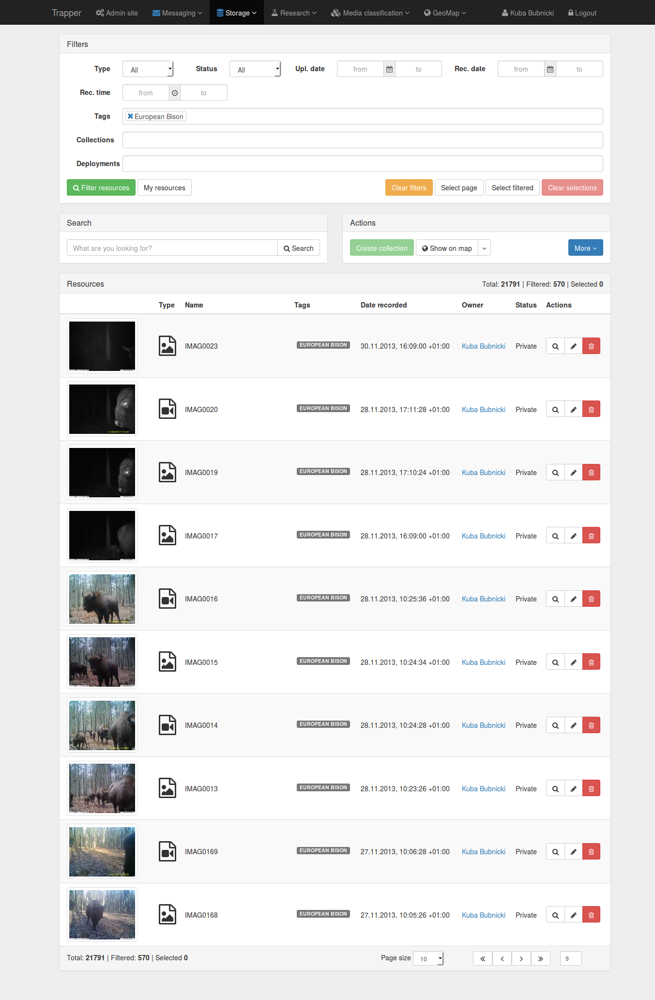

************************************************
Welcome to the **Trapper 1.0 beta** repository!
************************************************

***************************************
Overview
***************************************

Trapper is an open source, `django <https://www.djangoproject.com/>`_ based web application to manage `camera trapping <https://en.wikipedia.org/wiki/Camera_trap>`_ projects. Motion-triggered camera trapping is increasingly becoming an important tool in ecological research. Because of the nature of collected data (multimedia files) even relatively small camera-trapping projects can generate large and complex datasets. The organization of these large collections of multimedia files and efficient querying for a particular subsets of data, especially in a spatio-temporal context, is often a challenging task. Without an appropriate software solution this can become a serious data management problem, leading to delays and inaccessibility of data in the long run. We propose a new approach which, in contrary to available software solutions, is a fully open-source web application using spatially enabled data that can handle arbitrary media types (both pictures and videos), supports collaborative work on a project and data sharing between system users. We used state of the art and well-recognized open-source software components and modern, general purpose programming language Python to design a flexible software framework for data management in camera trapping studies.

.. note::
   The full documentation is in progress...

***************************************
Demo
***************************************
`<https://demo.trapper-project.org>`_

***************************************
Screenshots
***************************************

***************************************
Deployment notes
***************************************

=========================
Deployment assumptions
=========================

* system user that is used to run the django application: **web**
* home directory: **/home/web/trapper**
* nginx setup: **trapper.pl** server name; this should be changed
* nginx setup: ssl keys are already generated

=========================
System info
=========================

We recommend a distribution based on Debian e.g. `Ubuntu Server <http://www.ubuntu.com/server>`_. 
You have to setup a proper locale:

.. code-block:: text

   locale-gen en_US.UTF-8

=========================
System level dependencies
=========================

.. code-block:: text
  
   apt-get install postgresql-9.5 postgresql-contrib-9.5 postgresql-9.5-postgis 
   postgresql-server-dev-9.5 python-virtualenv python-dev libxml2-dev libjpeg8-dev 
   libxslt1-dev libgeos-dev libproj-dev libgdal-dev nginx supervisor rabbitmq-server
   ffmpeg libspatialindex-dev libyaml-dev gettext memcached

.. note::
   There is no ffmpeg for trusty (but there is for precise and xenial),
   so a ppa must be added:
   sudo add-apt-repository ppa:mc3man/trusty-media

=========================
PostGIS manual installation (if needed)
=========================

The compilation of PostgGIS requires the *root* privileges

.. code-block:: text

   wget http://download.osgeo.org/postgis/source/postgis-2.1.5.tar.gz
   tar zxvf postgis-2.1.5.tar.gz
   cd postgis*
   ./configure
   make
   make install

=========================
Database configuration
=========================

.. code-block:: text

   su postgres

   # use the same password as in your "settings.py" file
   # by default it is "trapper"
      
   createuser trapper -R -d -S -E -P

   psql -d template1 -c 'create extension postgis;'
   psql -d template1 -c 'create extension hstore;'

=========================
Django setup
=========================

Run the following scripts as the *web* user:

.. code-block:: text

   bin/devel.sh
   bin/reset_database.sh

Then you should configure the email backend. This can be done by modifying 
the following settings:

.. code-block:: python

   EMAIL_HOST
   EMAIL_HOST_PASSWORD
   EMAIL_HOST_USER
   EMAIL_PORT

.. warning::
   These settings should not be changed in the *settings.py* file because
   it can be accidentally pushed to the repository. Use the *settings_local.py*
   instead (this file is excluded from git).

.. note::
   If local SMTP server is used it has to be configured to be able to send
   email messages. Configuration of the SMTP server is out of the scope of this
   documentation.

When a new user or new research project is created, emails are sent to
all admins defined in a standard django settings file: *settings.ADMINS*.

.. note::
   It is preffered to define admin list in *settings_local.py* to protect
   emails from being publicly available in the repository.

=========================
Nginx setup
=========================

The following steps require the *root* privileges.

Update your */etc/nginx/nginx.conf* using a template config file **conf/nginx.conf**. 

Copy or symlink **conf/trapper.nginx.conf** to the nginx config directory
(by default it is */etc/nginx/sites-available*), then symlink the copied file to
*/etc/nginx/sites-enabled*.

Default trapper configuration assumes that you have already generated 
SSL certificates. For example you can get free SSL certificates from 
`Let's Encrypt <https://letsencrypt.org>`_.

Restart the nginx server:

.. code-block:: text

   /etc/init.d/nginx restart

If you are using a default configuration then you can edit */etc/hosts* and add entry:

.. code-block:: text

   127.0.0.1  trapper.pl

and then test your website deployment locally:

.. code-block:: text

   https://trapper.pl

.. warning::
   You should not use *trapper.pl* in your production unless you are the owner
   of this domain. Likely the browser will inform you about the wrong SSL certificate.

=========================
Supervisor
=========================

The following steps require the *root* privileges.

Copy or symlink **conf/supervisor.conf** to */etc/supervisor/conf.d*
and restart the supervisor:

.. code-block:: text

   /etc/init.d/supervisor restart

If everything is setup correctly then *supervisorctl* output should look like this:

.. code-block:: text

   # supervisorctl
   trapper                          RUNNING    pid 30969, uptime 0:01:26
   trapper-celery-beat              RUNNING    pid 30970, uptime 0:01:26
   trapper-celery-cam               RUNNING    pid 30968, uptime 0:01:26
   trapper-celery-worker            RUNNING    pid 30971, uptime 0:01:26

***************************************
External services
***************************************

There are few external services used by Trapper that are either required or preferred 
simply to make your work with the application more convenient and more productive. 

=========================
Email service
=========================

The email service is the only one that is **required**. An access to the SMTP server is required 
to make the notification framework working correctly. 

**Deployment notes** section provides the example of configuration of the email service.

.. warning::
   The  SMTP server configuration is not documented here. The trapper administrators
   are free to use the most suitable solution.

=========================
Celery
=========================

`Celery <http://celery.readthedocs.org/en/latest/index.html>`_ is an external
service used for running asynchronous tasks at the server. It is a task queue with focus 
on real-time processing, while also supporting task scheduling. 

The following settings can be used to configure celery's behaviour in the trapper
application:

* **CELERY_DATA_ROOT** - base directory where celery stores processed files
* **CELERY_ENABLED** - if set to False then all tasks will be launched
  synchronously (default is *True*)

***************************************
Thumbnails generation
***************************************

Each resource can have a thumbnail assigned. The process of thumbnails generation
(for images and video files) can be very time consuming. That is why this process is 
by default moved to a separate asynchronous task and done by celery.

The thumbnail generation process can be tuned with these settings:

* **CELERY_MIN_IMAGE_SIZE** - minimal image size in *Bytes* above which celery
  will be used (if enabled). Default is *10MB*
* **DEFAULT_THUMBNAIL_SIZE** - thumbnail image dimensions. By default it's *96x96* px
* **VIDEO_THUMBNAIL_ENABLED** if set to *False* then thumbnails for videos will not be 
  generated

.. note::
   Generating thumbnails for images uses `Pillow <https://pillow.readthedocs.org/index.html>`_.

.. note::
  Generating thumbnails for videos uses `ffmpeg <https://www.ffmpeg.org/>`_ 
  which has to be installed on the server.

***************************************
Uploading collections of resources
***************************************

Users can directly upload collections of resources using provided web interface or in a case of 
more heavy data sets using alternative methods (see the next section). To facilitate
multimedia processing prior to upload there are two python scripts available at
`<https://bitbucket.org/trapper-project/trapper-tools>`_ :

* **convert_media.py** - batch conversion of video files into web-friendly media formats;
  at the moment only *.mp4* and *.webm* formats are supported; this script uses
  `ffmpeg <https://www.ffmpeg.org/>`_ to convert videos
 
* **generate_package.py** - generates a data package (zipped multimedia files) with 
  accompanying `YAML <http://yaml.org/>`_ based package definition file which can 
  be further parsed by the trapper backend

    
Collections of resources that users want to process can be very large and processing them
can be very time consuming. Thus, a whole process is delegated to the celery which will
process them asynchronously.

The processing of uploaded collections has no custom settings to control the celery behaviour. 
Tasks are always delegated to the celery unless the celery is disabled with **CELERY_ENABLED**
set to *False*.

***************************************
Alternative upload methods
***************************************

Trapper users have dedicated directories that are created automatically when users
accounts are activated. These dedicated directories are associated with users profiles and 
recognized by the system. Resources or collections of resources can be then uploaded to 
the storage server using FTP or SSH protocols.

.. note::
   The root user's directory is defined by **EXTERNAL_MEDIA_ROOT** setting.

=========================
(S)FTP example
=========================

When the administrator of Trapper wants to enable an alternative upload through 
(S)FTP for the user *alice*, he needs to configure the *alice* (S)FTP account on the server and
point it's home directory to *EXTERNAL_MEDIA_ROOT/alice/*. He has to take care about
all necessary permissions that have to be set to allow the user to read and write files
within its home directory.  

.. note::
   The configuration of the (S)FTP (or SSH) server is out of the scope of this
   documentation.

***************************************
Software components
***************************************

=========================
Backend
=========================

The following is the list of the most important software components that have been used to 
design and implement Trapper: 

* `Ubuntu <http://www.ubuntu.com>`_

  A base operating system under which Trapper was developed and tested.

* `PostgreSQL <http://postgresql.org>`_

  The open source and industry standard relational database management system (RDBMS) 
  with `PostGIS <http://postgis.net/>`_  as its spatial extension.

* `nginx <http://nginx.org/>`_

  nginx [engine x] is an HTTP and reverse proxy server, a mail proxy server, and a generic TCP proxy server.

* `Gunicorn <http://gunicorn.org>`_

  This pure-python application is used to serve Trapper project.

* `Supervisor <http://supervisord.org/>`_

  This application is used to control all project related external applications
  like celery.

* `Celery <http://www.celeryproject.org/>`_

  This python application is used to run various tasks in asnynchronous mode
  allowing Trapper to work faster and more efficient. The celery is used to generate
  thumbnails from large files or videos, or to process uploaded collections
  by users.

* `Django <https://www.djangoproject.com/>`_

  The core component of Trapper, a high-level Python web framework maintained by the 
  Django Software Foundation. Django framework simplifies and significantly speeds up the 
  creation of complex, database-driven websites and emphasizes reusability and pluggability 
  of their components. Additionally, the following 3rd party, open source django applications 
  have been used to develop Trapper. For a complete list of these applications see 
  `this file <https://bitbucket.org/trapper-project/trapper-project/src/1887fb419dbeda3c9de8adec5fd34ef46f167e1d/setup.py?at=master>`_

* `uMAP <https://github.com/umap-project/umap/>`_
  uMap lets you create maps with OpenStreetMap layers in a minute and embed them in your 
  site. It uses django-leaflet-storage and Leaflet.Storage, built on top of Django and Leaflet.

=========================
Frontend
=========================

Trapper's front-end is developed based on three independent solutions:

1) HTML (version 5) templates and their CSS styles (powered by `SASS <http://sass-lang.com/>`_) 
2) set of scripts written in pure JavaScript (ECMAscript 5).
3) all the external libraries and frameworks included in the project:

* Twitter Bootstrap

  `Bootstrap Sass Official <https://github.com/twbs/bootstrap-sass>`_ which is
  official SASS version of `Twitter Bootstrap <http://getbootstrap.com/>`_.
  This library provides a set of HTML components and CSS styles used for
  Trapper scaffold creation.

* Font Awesome

  `Font Awesome <http://fortawesome.github.io/Font-Awesome/>`_ - webfont of
  vector icons used in the project.

* Angular JS

  `Angular JS <https://angularjs.org/>`_ all the grids/tables including their filters
  has been build on top of this Google's framework

* Angular Cookies

  Official `angular module <https://github.com/angular/bower-angular-cookies>`_
  for cookies management.

* Angular Sanitize

  Official `angular module <https://github.com/angular/bower-angular-sanitize>`_
  which improves angular templates data binding.

* Moment

  Extremaly powerful `library <http://momentjs.com/>`_ for date parsing & manipulation.

* Select2

  Complete `solution <https://select2.github.io/>`_ that extends default HTML select controls.

* Select2 Bootstrap CSS

  `CSS styles <https://github.com/t0m/select2-bootstrap-css>`_ for Select2 so it fits
  Twitter Bootstrap feel & look.

* Bootstrap WYSIHTML5

  `Javascript Plugin <https://github.com/Waxolunist/bootstrap3-wysihtml5-bower>`_ which
  brings WYSIWYG text editor to the table.

* Bootstrap Datepicker http://eternicode.github.io/bootstrap-datepicker/

  `Javascript Widget <http://eternicode.github.io/bootstrap-datepicker/>`_ - simple datepicker.

* Jquery Timepicker

  `Jquery Widget <http://jonthornton.github.io/jquery-timepicker/>`_ which is just a timepicker.

* Bootstrap Datetimepicker

  `Javascript Widget <http://eonasdan.github.io/bootstrap-datetimepicker/>`_ that
  combines both time and date picker.

* Video JS

  This `library <http://www.videojs.com/>`_ extends standard HTML5 video players.

* Video JS Rangeslider

  Video JS `plugin <https://github.com/danielcebrian/rangeslider-videojs>`_ that
  allows to set and get video sequences.

***************************************
X-Sendfile
***************************************

X-Sendfile (see for example `<http://wiki.nginx.org/XSendfile>`_) allows verification of django-based 
user's permissions before specific content is sent to a user (e.g. multimedia file). However, Django 
will not serve a content - it is done by a web server that can handle it much more efficient. 

=========================
Logic
=========================

Basic X-Sendfile flow:

1) a request from nginx is sent to the Trapper application
2) Django determines if a user has right permissions to see a content

* if access is granted special headers will be included in a response to inform nginx how to proceed
* if access is not granted negative (forbidding) response is returned

3) a response is received back by nginx
4) a proper content is sent to a user by nginx

=========================
Settings
=========================

.. code-block:: python

  # Base place for media that should be served through x-sendfile
  SENDFILE_ROOT = MEDIA_URL

  # Default directory within SENDFILE_ROOT for files served through x-sendfile
  SENDFILE_MEDIA_PREFIX = 'protected/'

  # Used by a middleware to fake x-sendfile for development instances
  # DO NOT USE IT ON PRODUCTION
  SENDFILE_DEV_SERVER_ENABLED = False

  # Header that will be added to a response. Differs between web servers.
  # This one is for nginx
  SENDFILE_HEADER = 'X-Accel-Redirect'

=========================
Resources
=========================

All resources (part of the storage application) use X-Sendfile to control the access to the
*file*, *file_thumbnail*, *file_preview* and *extra_file* model fields. 

Trapper does not use direct urls to serve images/movies/audio. All media files are
stored in **SENDFILE_ROOT** + **SENDFILE_MEDIA_PREFIX** and each handled field
has its own method responsible for returning a proper url. Instead of returning a direct 
url to a media file, a special serve-view url is returned.

In this view a requested media file of given resource is verified against currently
logged in user's permissions. If a user can view details of this resource, then a media file 
can be served by nginx and django will add special headers to a response. Otherwise 
a default image (access forbidden) is returned.

=========================
nginx
=========================

The nginx configuration is quite minimalistic:

.. code-block:: text

    location /media/protected/ {
         alias /home/web/trapper/trapper/media/protected/;
         internal;
    }

Using the `internal` flag allows files from a specified location to be served
only by nginx.

=========================
Django admin
=========================

Since nginx will not serve media files directly, django admin panel had to be 
altered to allow using fileinput widget (which shows url to actual media url if
given field is not empty).

Widget combined with a special view allows user to see a media file from protected
directory directly but **only** if request is made by user that **is staff**
or **is superuser**. Otherwise the forbidden response is returned.

An example of a url for a direct media file access looks like:

.. code-block:: text

   /serve/direct/?file=protected/storage/resource/example_image.jpg
